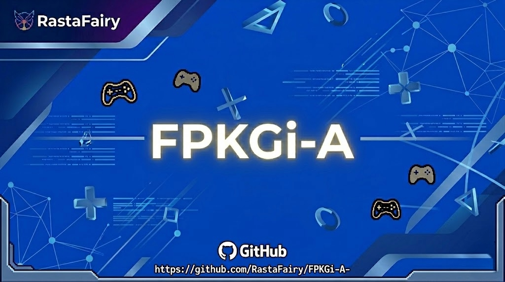

# FPKGi Manager — Android

<p align="center">
  
</p>

<p align="center">
  
  
  
  
</p>

> Gestor de paquetes FPKG para PS4 en Android. Explora tu librería, verifica disponibilidad, descarga paquetes, envíalos a tu PS4 por FTP y consulta actualizaciones desde OrbisPatches — todo sin salir de la app.

---

## 📋 Índice

- [Características](#-características)
- [Requisitos](#-requisitos)
- [Instalación](#-instalación)
- [Uso](#-uso)
- [Estructura del proyecto](#-estructura-del-proyecto)
- [Compilación](#-compilación)
- [Historial de cambios](#-historial-de-cambios)
- [Contribuciones](#-contribuciones)
- [Licencia](#-licencia)

---

## ✨ Características

| Función | Detalle |
|---|---|
| 📚 **Librería JSON** | Compatible con formato FPKGi (dict) y PS4PKGInstaller (lista) |
| 🔍 **Búsqueda y ordenación** | Filtra por nombre, Title ID o región; ordena por cualquier columna |
| ✅ **Verificar disponibilidad** | Comprobación HTTP HEAD de las URLs de descarga |
| ⬇️ **Gestor de descargas** | Descargas en segundo plano con pausa y reanudación |
| 📡 **FTP a PS4** | Envía PKGs directamente a la consola por FTP (requiere ftpd) |
| 📂 **Explorador de PKGs locales** | Escanea el almacenamiento del dispositivo y sube por FTP |
| 🔄 **OrbisPatches** | Información de parches por juego: versión, FW requerido, tamaño, fecha y notas |
| 🌐 **6 Idiomas** | Español, inglés, alemán, francés, italiano y japonés |
| 🆕 **Auto-actualización** | Detecta nuevas versiones en GitHub Releases e instala sin salir de la app |
| 🎨 **Tema oscuro** | Paleta navy/cyan/dorado optimizada para OLED |

---

## 📋 Requisitos

- Android **10 (API 29)** o superior
- Un fichero JSON exportado desde FPKGi o PS4PKGInstaller
- Para FTP: una PS4 con servidor FTP compatible (por ejemplo `ftpd`, `PS4FTP`, `goldhen ftpd`)
- Para la instalación in-app: permitir instalación desde fuentes desconocidas cuando se solicite

---

## 📥 Instalación

### Desde GitHub Releases *(recomendado)*

1. Ve a [Releases](https://github.com/RastaFairy/FPKGi-A-/releases/latest)
2. Descarga el último `.apk`
3. Instálalo en tu dispositivo Android
4. Permite la instalación desde fuentes desconocidas si se solicita

### Compilar desde el código fuente

Consulta la sección [Compilación](#-compilación).

---

## 🚀 Uso

### Cargar tu librería

1. Abre la app
2. Pulsa el **icono de carpeta** en la barra superior
3. Selecciona tu fichero `games.json`

La app soporta el formato FPKGi (dict con clave `DATA`) y el formato PS4PKGInstaller (lista plana de paquetes).

### Explorar un juego

Pulsa cualquier juego para abrir la pantalla de detalle. Desde allí puedes:

- **Verificar disponibilidad** — comprueba si la URL del PKG responde
- **Descargar PKG** — inicia una descarga en segundo plano, opcionalmente enviada por FTP
- **Ver actualizaciones** — muestra todos los parches conocidos con versión, firmware requerido, tamaño, fecha de creación y notas del parche

### Configurar FTP

1. Ve a **Ajustes → Configuración FTP**
2. Introduce la IP de tu PS4, el puerto (por defecto 2121) y la ruta remota (por defecto `/data/pkg`)
3. Pulsa **Probar conexión**
4. Activa FTP — a partir de ahora todas las descargas van directamente a tu PS4

### Auto-actualización

Cuando hay una versión nueva disponible en GitHub, aparece un diálogo al arrancar la app con el changelog. Pulsa **"Ver en GitHub"** y la app descarga e instala el nuevo APK automáticamente — sin necesidad de abrir el navegador.

---

## 🗂 Estructura del proyecto

```
app/src/main/java/com/fpkgi/manager/
├── MainActivity.kt              # Navegación, diálogo de actualización
├── MainViewModel.kt             # Estado, descargas, OrbisPatches, comprobador de actualizaciones
├── data/
│   ├── model/Models.kt          # Game, OrbisPatch, DownloadItem, FtpConfig…
│   └── repository/
│       └── SettingsRepository.kt
├── i18n/
│   └── StringResources.kt       # Definiciones de cadenas en 6 idiomas
├── network/
│   ├── FtpDownloadService.kt    # Servicio en primer plano: descarga + subida FTP
│   ├── OrbisClient.kt           # Scraper de 2 niveles (API JSON + DOM WebView)
│   ├── OrbisWebViewClient.kt    # WebView Chromium + polling DOM
│   └── UpdateChecker.kt         # Cliente de la API de GitHub Releases
├── ui/
│   ├── screens/
│   │   ├── GameListScreen.kt
│   │   ├── GameDetailScreen.kt
│   │   ├── DownloadsScreen.kt
│   │   ├── LocalPkgBrowserScreen.kt
│   │   └── SettingsScreen.kt
│   └── theme/                   # Colores, tipografía, formas
└── utils/
    └── JsonParser.kt            # Parser JSON de doble formato
```

---

## 🔨 Compilación

```bash
# Clonar el repositorio
git clone https://github.com/RastaFairy/FPKGi-A-.git
cd FPKGi-A-

# Compilación debug
./gradlew assembleDebug

# Compilación release (requiere configuración de firma)
./gradlew assembleRelease
```

**Requisitos:** Android Studio Hedgehog o posterior, JDK 21, Android SDK 36.

---

## 📜 Historial de cambios

Consulta [CHANGELOG_ES.md](CHANGELOG_ES.md) para el historial completo de versiones.

---

## 🤝 Contribuciones

Los pull requests son bienvenidos. Para cambios importantes, abre primero un issue para discutir lo que quieres cambiar.

---

## 📄 Licencia

[MIT](LICENSE) — consulta el fichero LICENSE para más detalles.

---

<p align="center">
  Concepto original de <strong>Bucanero</strong> (PSP) e <strong>ItsJokerZz</strong> (PS4/PS5) · Puerto Android por <strong>RastaFairy</strong>
</p>
